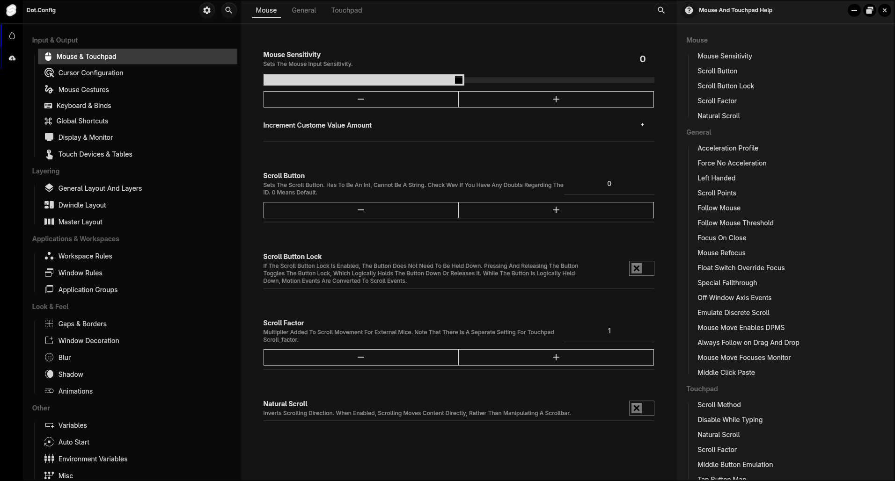
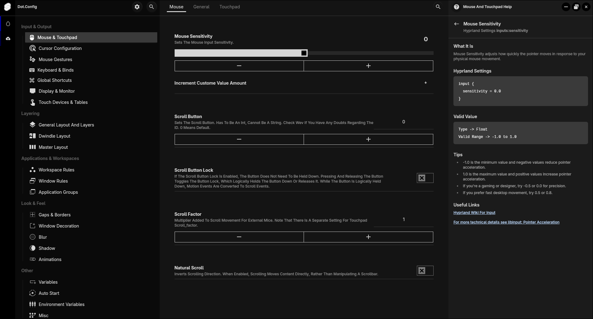
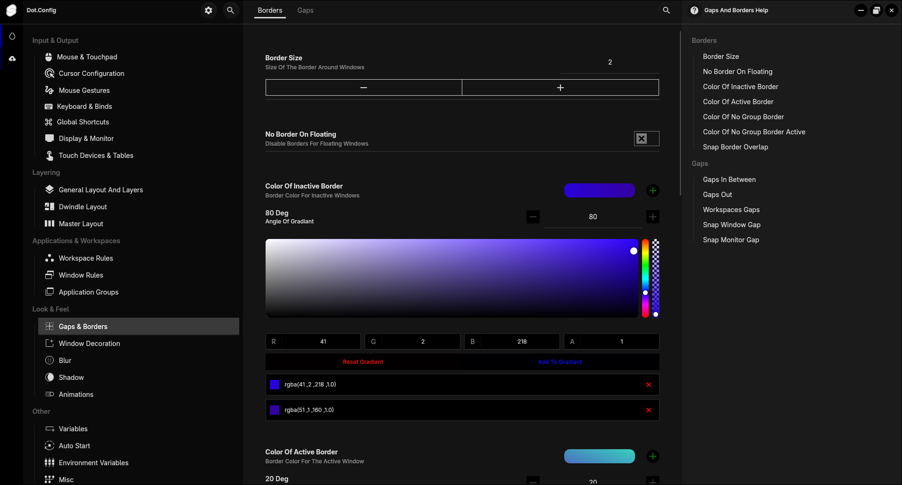
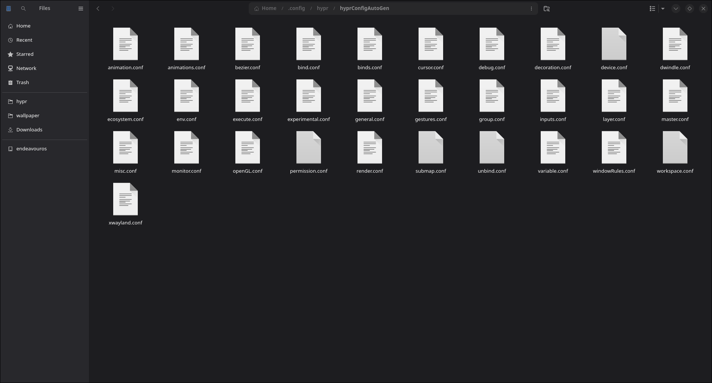
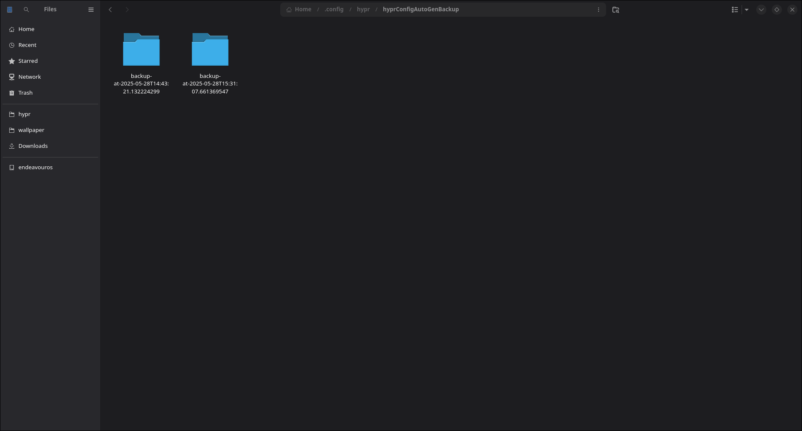

## Dot.Config Project

This is a project that aims to making editing and creating new or existing hyprland settings in a graphical settings app.

### Development

This project is under active development. Many features are missing and many reactors are waiting to be done.
But it can be used for editing of settings

##### Simple Overview

This project has three parts desktop ui, Websocket server, Hyprland Parser.

First, when open the app it will go to your hyprland settings file at `~/.config/hypr/hypr.config` and search thought all the
source files and build a new hyprland settings configuration file in there with your old config, and it will create backups

So it will support your existing hyprland settings and let you make changes to hyprland settings from the ui without anything breaking.

##### Support

This project only supports ***version 49 of hyprland*** and if you try this in any other version, it will break the hyprland.
    
>[!WARNING] ONLY VERSION 49 IS SUPPORTED

###### Support Settings

* All The subcategories of supported categories are working

- [x] General settings -> [Hyprland general](https://wiki.hypr.land/Configuring/Variables/#general)
- [x] Input settings -> [Hyprland input](https://wiki.hypr.land/Configuring/Variables/#input)
- [x] Decoration settings -> [Hyprland Decoration](https://wiki.hypr.land/Configuring/Variables/#decoration)
- [x] Gestures settings -> [Hyprland Gestures](https://wiki.hypr.land/Configuring/Variables/#gestures)
- [x] Group settings -> [Hyprland Group](https://wiki.hypr.land/Configuring/Variables/#group)
- [x] Misc settings -> [Hyprland Misc](https://wiki.hypr.land/Configuring/Variables/#misc)
- [x] XWayland settings -> [Hyprland XWayland](https://wiki.hypr.land/Configuring/Variables/#general)
- [x] OpenGL settings -> [Hyprland OpenGL](https://wiki.hypr.land/Configuring/Variables/#opengl)
- [x] Render settings -> [Hyprland Render](https://wiki.hypr.land/Configuring/Variables/#render)
- [x] Cursor settings -> [Hyprland Cursor](https://wiki.hypr.land/Configuring/Variables/#cursor)
- [x] Ecosystem settings -> [Hyprland Ecosystem](https://wiki.hypr.land/Configuring/Variables/#ecosystem)
- [x] Experimental settings -> [Hyprland Experimental](https://wiki.hypr.land/Configuring/Variables/#experimental)
- [x] Debug settings -> [Hyprland Debug](https://wiki.hypr.land/Configuring/Variables/#debug)

Not Working yet but will get support soon

- [ ] Keybinds / Keyboard
- [ ] Window / Workspaces
- [ ] auto strat / env
- [ ] animations / curves
- [ ] variables
